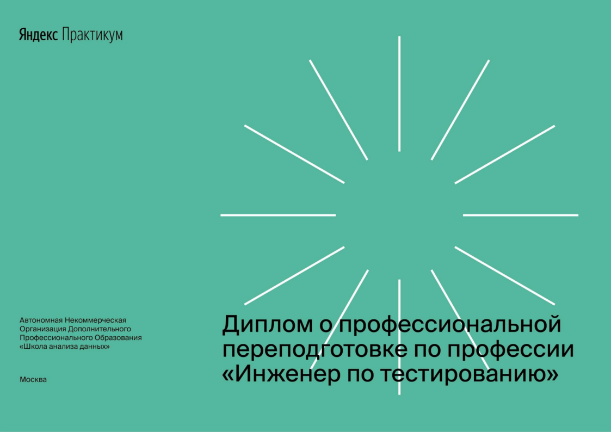
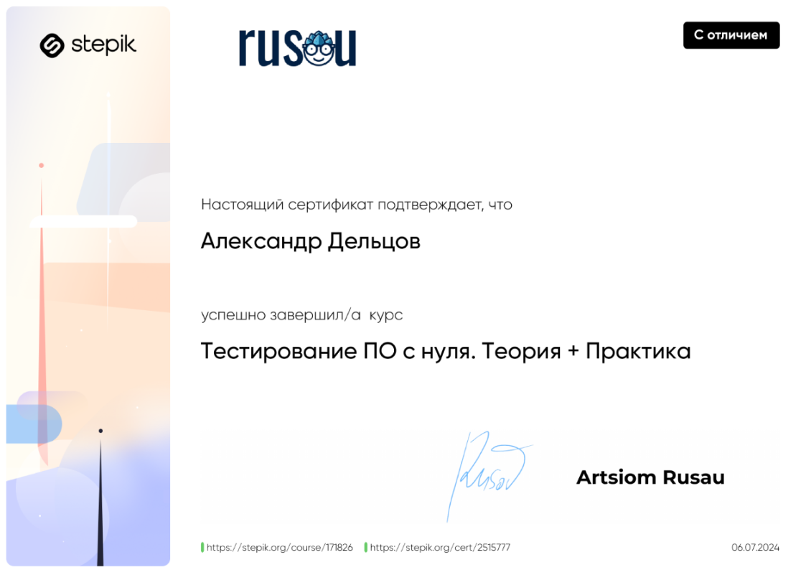
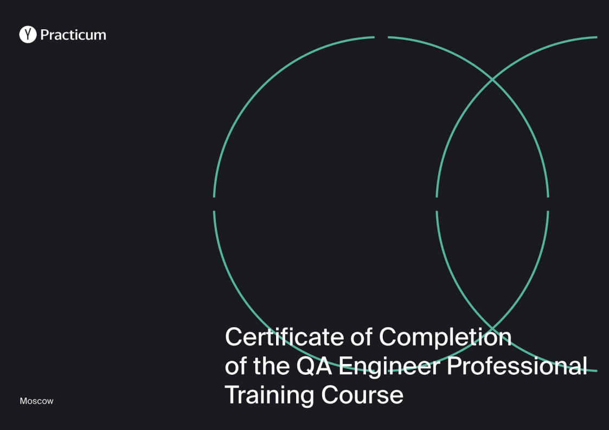
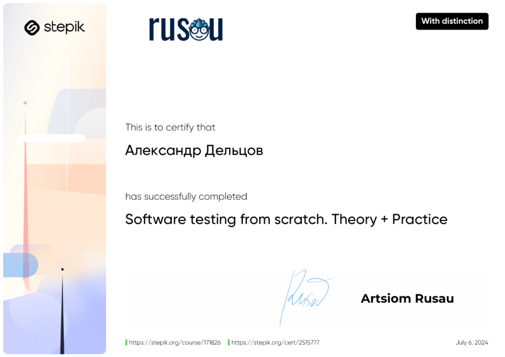

# Hello World

## 📞 Contact Me:

  
  
  

## 🧪 My QA Projects:

### 🔍 Automated Tests in progress:

  

### 📝 Test Cases and Check List:

  

---

## 🚀 Tools and Technologies:

### 📁 Test Documentation:

  
  
  
  

### 🛠 Web Application Testing:

  
  

### 📱 Mobile Application Testing:

  
  

---

  
  
  
  
  

---
---

## 🎓 Certifications (RUS):

  
  

## 🎓 Certifications (ENG):

  
  

